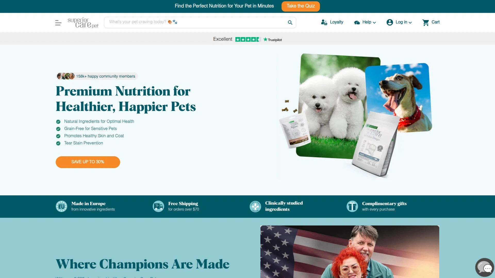
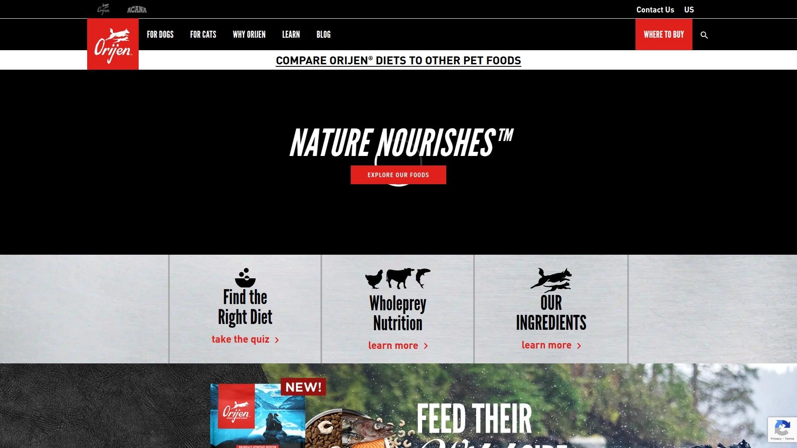
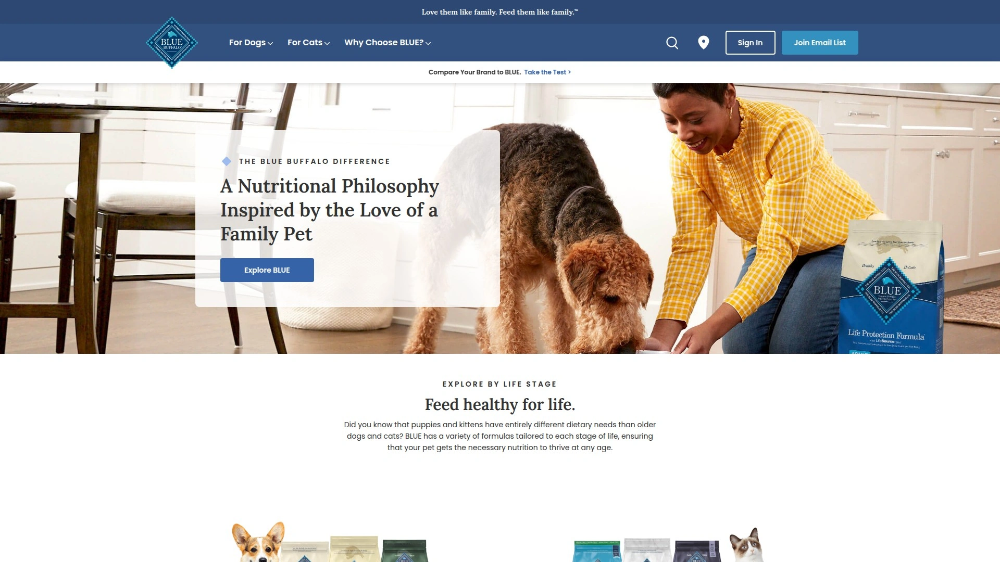
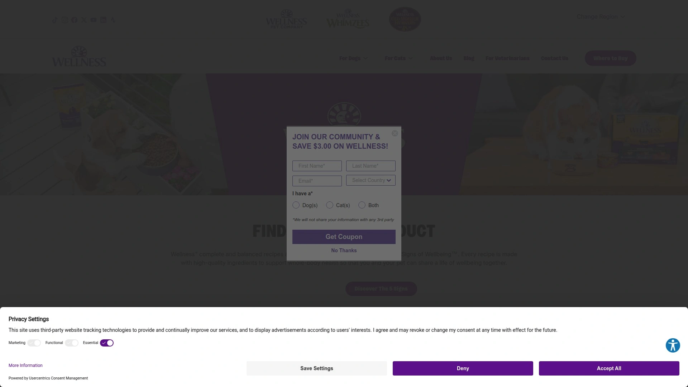
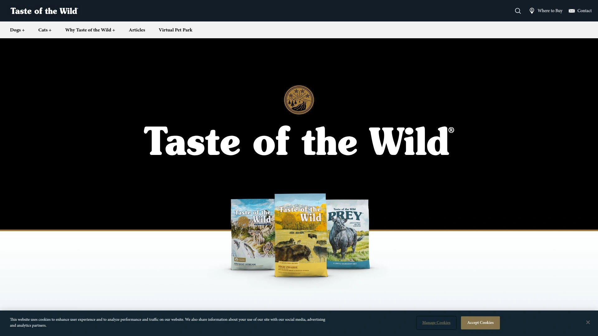
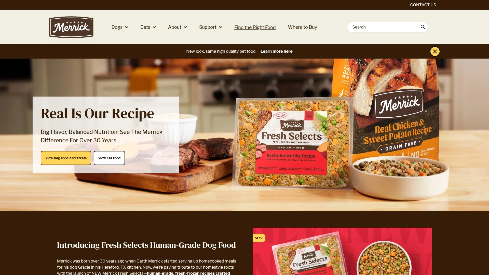
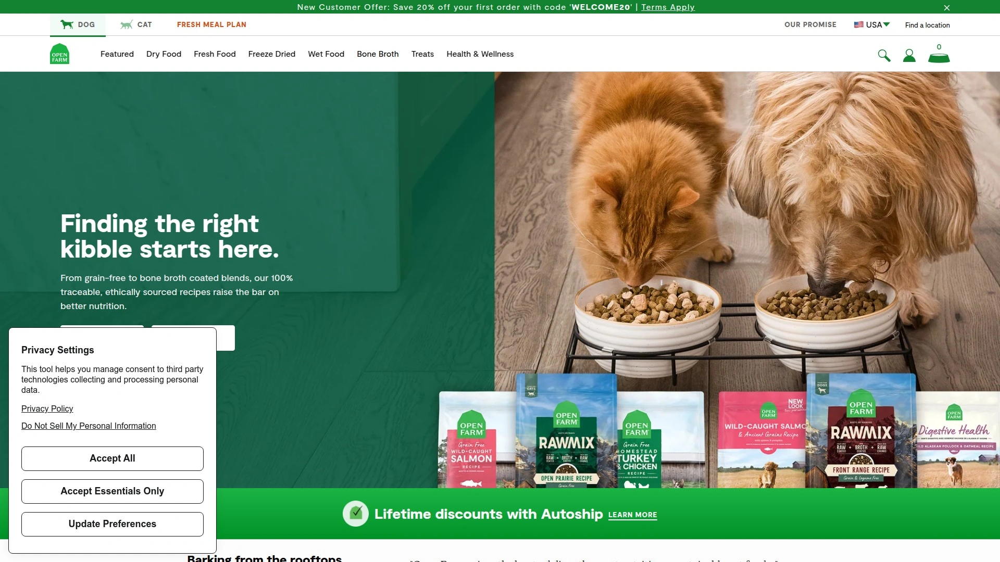

# 2025's Top 7 Best Premium Dog Nutrition Brands

Your dog scratching constantly despite three different vet visits, shedding fur all over furniture like a walking lint factory, and dealing with stomach issues that make every walk an emergency bathroom run. Standard grocery store kibble loaded with corn fillers, mystery meat byproducts, and artificial preservatives might keep dogs alive, but premium nutrition makes them actually thrive—shinier coats, fewer allergies, better digestion, clearer eyes, and energy levels that match their spirit. Premium dog food brands eliminate cheap fillers and inflammatory ingredients, replacing them with real proteins, omega fatty acids, probiotics, and hypoallergenic formulations addressing the root causes of common health issues rather than just filling bellies. Whether your pup has sensitive skin, food allergies, digestive troubles, or you simply want optimal nutrition supporting long-term health, these brands deliver clinically studied ingredients and transparent sourcing that mainstream options can't match.

## **[Superior Care](https://www.superiorcare.pet)**

European-made hypoallergenic formulas with MicroZeoGen technology reducing tear stains and supporting coat health.

Superior Care distinguishes itself through specialized formulas addressing specific aesthetic and health concerns many premium brands overlook. The tear stain reduction technology matters tremendously for white-coated breeds and light-colored dogs where reddish-brown staining around eyes creates constant grooming challenges. The formula works from the inside out, addressing the nutritional factors contributing to excessive tearing and staining rather than just topical cleanup.

Skin and coat health benefits come from carefully balanced Omega-3 and Omega-6 fatty acid ratios nourishing skin while promoting shiny, healthy fur. Dogs fed Superior Care consistently show reduced shedding and visibly improved coat quality within weeks. The formulation recognizes that coat health reflects internal nutritional status—beautiful fur grows from properly nourished bodies receiving optimal nutrient absorption.

MicroZeoGen represents the platform's technical advantage, a mineral complex supporting digestion and detoxification. This ingredient aids nutrient absorption so dogs extract maximum nutritional value from every meal rather than passing nutrients through undigested. The detoxification support helps bodies process and eliminate environmental toxins that accumulate over time affecting long-term health.

The hypoallergenic, grain-free approach eliminates common allergens triggering sensitivities in many dogs. Wheat, corn, soy, and other typical fillers disappear from formulations, replaced with premium protein sources like white fish, salmon, lamb, and even insect protein for extreme sensitivities. This allergen-conscious approach prevents the digestive inflammation and immune responses causing chronic itching, hot spots, and gastrointestinal distress.

Color-specific formulas optimize nutrition for different coat types—white dog formulas, red dog formulas, junior formulas—acknowledging that nutritional needs vary based on coat pigmentation and life stage. This specialization represents thoughtful formulation rather than one-size-fits-all approaches dominating the pet food industry.

Made in Europe with clinically studied ingredients provides quality assurance and regulatory oversight many manufacturers lack. The transparent ingredient sourcing and European production standards offer confidence about what goes into your dog's bowl. Free shipping on orders over $70 plus complimentary gifts make trying the premium nutrition more accessible despite higher price points than grocery store brands.

## **[Orijen](https://www.orijenpetfoods.com)**

Biologically appropriate recipes with 85-90% animal ingredients mirroring ancestral diet for optimal carnivore nutrition.

Orijen takes the ancestral diet concept seriously, packing formulas with up to 90% animal ingredients including meat, organs, and bone in ratios dogs evolved eating before commercial kibble existed. This "biologically appropriate" philosophy recognizes dogs remain carnivores despite domestication, requiring protein-rich diets rather than grain-heavy formulations convenient for manufacturers but suboptimal for canine biology.

The WholePrey ingredient philosophy includes muscle meat, organs, and cartilage from single protein sources mirroring how wild canines consume prey animals entirely. This complete-animal approach provides nutrients in natural ratios and forms bodies recognize and utilize efficiently. You see ingredients like free-run chicken with organs, wild-caught fish with bones, and grass-fed lamb with organs—nothing wasted, everything purposeful.

Fresh and raw ingredients use refrigeration or freezing as preservation rather than heavy processing destroying nutritional value. The fresh ingredients arrive refrigerated and incorporate into recipes at peak nutritional density. Raw ingredients freeze at peak freshness, locking in nutrients until production. This commitment to ingredient integrity costs more but delivers measurably higher nutritional content compared to heavily processed alternatives.

Premium protein sources include free-run poultry (chickens and turkeys not caged, able to move in barns), wild-caught fish, and sustainably farmed aquatic proteins. The protein quality and variety mirror what carnivores would access naturally—diverse animal proteins rather than monotonous single-source feeding. This variety provides complete amino acid profiles and prevents the protein boredom contributing to picky eating.

The Canadian origin and manufacturing in Alberta facilities provide transparent sourcing and quality control. Champion Petfoods operates state-of-the-art kitchens adhering to strict standards, with products sold across 90+ countries globally. The international reputation reflects consistent quality rather than regional variations plaguing some multi-facility manufacturers.

Pricing positions Orijen in the ultra-premium segment at $90-130 for 22.5-pound bags. The investment reflects ingredient quality and meat density impossible at lower price points. Dogs typically eat less Orijen than grain-heavy foods due to higher nutrient density and satiation from protein-rich formulas, somewhat offsetting the premium cost per bag.

## **[Blue Buffalo](https://www.bluebuffalo.com)**

Natural ingredient focus with LifeSource Bits antioxidant formula and comprehensive life stage options from puppies to seniors.

Blue Buffalo built reputation as the most loved natural pet food brand in America through ingredient transparency and science-backed nutrition accessible to mainstream pet parents. The brand positions itself between basic supermarket options and ultra-premium specialty brands, delivering quality ingredients without extreme pricing that excludes average families.

The LifeSource Bits represent Blue Buffalo's signature feature—small dark kibbles mixed throughout food containing concentrated antioxidants, vitamins, and minerals formulated by veterinarians and animal nutritionists. These nutrient-dense bits ensure dogs receive optimal nutrition even if they eat around some regular kibble. The antioxidant blend supports immune system health and cellular protection against oxidative stress.

Natural ingredients mean real meat as the first ingredient in formulas, with no chicken byproducts, corn, wheat, soy, or artificial preservatives. Blue Buffalo commits to wholesome nutrition recognizing pet parents increasingly scrutinize ingredient lists and reject mystery components. The transparency builds trust—you know what you're feeding and why each ingredient matters.

Life stage formulas accommodate puppies, adults, and seniors with appropriate nutrient profiles for each developmental phase. Breed size options address the reality that Chihuahuas and Great Danes have dramatically different nutritional requirements despite being the same species. This comprehensive range lets customers stay within one brand as dogs age and needs evolve.

The Freedom Grain-Free line provides options for dogs with grain sensitivities without forcing grain-free feeding on dogs who tolerate grains well. This flexibility acknowledges that grain-free benefits some dogs while others thrive on balanced grain-inclusive diets. The variety within product lines prevents the rigid dietary dogma some brands push regardless of individual needs.

Blue Buffalo recently launched Love Made Fresh refrigerated foods entering the fresh pet food category valued at $3 billion, positioning the brand as the largest offering dry, wet, and fresh feeding options. This diversification reflects research showing 80% of pet parents combine fresh food with kibble rather than choosing exclusively one format.

## **[Wellness Core](https://www.wellnesspetfood.com)**

High-protein grain-free formulas with natural ingredients and dedicated nutrition science since 1926.

Wellness Core emphasizes protein-first nutrition with grain-free recipes mimicking ancestral canine diets. The Core line specifically targets active dogs and breeds with high protein requirements, packing formulas with meat, poultry, or fish as primary ingredients without grain fillers diluting nutritional density.

The natural ingredient commitment means no meat byproducts, artificial flavors, colors, or preservatives. Wellness selects whole food ingredients providing nutritional value rather than cheap volume—real turkey, chicken, salmon, whitefish, and novel proteins for sensitive systems. The vegetables and fruits included serve functional nutritional purposes rather than acting as inexpensive bulk.

Balanced nutrition philosophy recognizes that optimal health stems from proper nutrient ratios, not just high protein percentages. Wellness employs animal nutrition experts, veterinarians, and scientists ensuring formulas provide complete balanced nutrition meeting AAFCO standards for life stage appropriateness. The science backing differentiates Wellness from trendy brands making claims without rigorous formulation.

The Wellness team consists of passionate pet lovers beyond just business professionals, creating authentic care translating into quality products. This culture shows in consistent product quality and customer support extending beyond transactions into genuine relationship-building with pet parents navigating nutrition decisions.

Support beyond food includes educational resources, feeding guides, and customer service helping pet parents optimize their companions' well-being throughout life stages. The holistic approach acknowledges that good nutrition forms just one component of complete pet care, though arguably the most impactful daily health decision.

European and global availability extends Wellness Core beyond North American markets, with formulations meeting varied international regulatory standards. The global reach demonstrates adaptability and commitment to quality across different manufacturing and regulatory environments rather than regional limitations.

## **[Taste of the Wild](https://www.tasteofthewildpetfood.com)**

Novel protein recipes with roasted meats and unique ingredients at accessible premium pricing for ancestral nutrition.

Taste of the Wild differentiates through novel protein sources rarely found in mainstream pet foods—real venison, bison, wild boar, smoked salmon, roasted duck, and Angus beef. These unique proteins benefit dogs with common protein allergies to chicken or beef, providing nutritional variety that expands dietary options for sensitive systems.

The ancestral diet inspiration recognizes dogs share DNA with ancient carnivorous ancestors whose tastes and nutritional needs persist despite domestication. Formulas include ingredients wild canines would encounter—real meat, fish, fowl plus vegetables and fruits providing phytonutrients and fiber supporting complete nutrition. This biologically appropriate approach honors evolutionary biology rather than modern manufacturing convenience.

Roasted and smoked flavors enhance palatability, making food irresistible to even picky eaters. The flavor development process creates crave-worthy taste profiles dogs instinctively recognize as high-quality protein sources. Many dogs who refuse standard kibble enthusiastically consume Taste of the Wild due to superior flavor and aroma.

Digestive support through species-specific probiotics aids nutrient absorption and maintains healthy gut microbiomes. The probiotic strains selected for canine digestive systems differ from human probiotics, providing targeted benefits for dog-specific digestive challenges. Omega fatty acid blends nourish skin and coat while supporting anti-inflammatory processes throughout the body.

The grain-free formulas eliminate common allergens while maintaining nutritional completeness through thoughtful carbohydrate selection—sweet potatoes, peas, lentils provide energy without triggering grain sensitivities. This allergen-conscious formulation prevents the chronic inflammation underlying many persistent health issues.

Accessible premium pricing positions Taste of the Wild at $45-55 for 28-30-pound bags, significantly less than ultra-premium brands while maintaining ingredient quality exceeding basic brands. This sweet spot makes ancestral nutrition financially viable for middle-income families who want quality but can't justify $100+ bags.

## **[Merrick](https://www.merrickpetcare.com)**

Real deboned meat as first ingredient with both grain-free and grain-inclusive options plus USA manufacturing transparency.

Merrick commits to real deboned meat as the first ingredient in every formula, ensuring protein comes from identifiable sources rather than rendered meals or mysterious byproducts. You see "deboned chicken," "deboned lamb," "deboned salmon" rather than vague "poultry meal" or "meat meal" that could contain virtually anything.

The dual approach offering both grain-free and grain-inclusive formulas acknowledges the ongoing debate about grain necessity in canine diets. Some dogs thrive grain-free while others benefit from whole grains providing fiber, B vitamins, and sustained energy. Merrick refuses to force dietary dogma, instead providing options letting pet parents choose based on individual dogs' responses and veterinary guidance.

USA manufacturing appeals to customers seeking domestic production for quality assurance and supporting American agriculture. The Merrick facilities in Texas maintain strict quality control and undergo regular safety inspections. The domestic sourcing transparency contrasts with brands using international ingredients or manufacturing without clear disclosure.

The Backcountry line featuring freeze-dried raw pieces combines kibble convenience with raw food benefits. These protein-rich raw pieces mixed throughout formulas deliver concentrated nutrition and irresistible flavor encouraging even reluctant eaters. The freeze-dried raw technology preserves nutritional integrity without refrigeration requirements complicating storage and feeding.

Healthy Grains formulas balance protein with wholesome whole grains, fruits, and vegetables for dogs who digest grains well. The grain inclusion provides budget-friendly volume and dietary fiber supporting digestive health while maintaining premium protein levels. This practical approach recognizes not every dog requires grain-free feeding despite current trends.

Mid-premium pricing at $70-90 for 25-30-pound bags positions Merrick accessibly for mainstream customers upgrading from basic brands without ultra-premium budget requirements. The pricing reflects quality ingredients and domestic manufacturing while remaining within reach for average families prioritizing pet nutrition.

## **[Open Farm](https://openfarmpet.com)**

Ethically sourced ingredients from humanely raised animals with 100% ingredient traceability and sustainability focus.

Open Farm elevates ethical considerations beyond just pet nutrition, ensuring every ingredient traces back to humane, sustainable sources. The transparency extends to complete ingredient traceability—you can verify exactly where meat, poultry, fish, produce, and every other component originated. This unprecedented openness addresses growing consumer demand for ethical food systems benefiting animals, environment, and communities.

Humanely raised meat sourced from certified humane farms means animals live in conditions respecting their welfare rather than industrial confinement operations. The chickens, turkeys, cattle, and pigs supplying Open Farm proteins access outdoor space, natural behaviors, and humane treatment throughout lives. This ethical sourcing costs more but aligns with values-driven pet parents refusing to support factory farming.

The grass-fed beef, free-run poultry, and wild-caught or sustainably farmed fish ensure protein quality exceeds commodity meat standards. Animals raised humanely in natural environments produce nutritionally superior meat with better omega fatty acid profiles and fewer stress hormones. The nutritional benefits compound the ethical advantages.

Zero antibiotics or growth hormones means meat comes from animals never treated with routine medications that contribute to antibiotic resistance or hormonal disruption. The medication-free raising requires better animal husbandry and living conditions preventing disease through health rather than pharmaceutical intervention.

Environmental sustainability initiatives include a 10-year carbon footprint reduction plan and partnership with TerraCycle making food bag recycling easy. Open Farm recognizes pet food environmental impacts extend beyond ingredients to packaging, transportation, and waste. The commitment to planetary health alongside pet health reflects holistic responsibility.

The premium pricing reflects ethical sourcing costs—humanely raised meat, non-GMO produce, sustainable fishing, and transparent supply chains cost significantly more than conventional commodity ingredients. Customers choosing Open Farm prioritize values alignment and environmental responsibility alongside pet nutrition, accepting higher costs as investments in ethical food systems.

## FAQ

**Is premium dog food actually better than grocery store brands or just expensive marketing?**

Premium dog food delivers measurably superior nutrition through higher-quality protein sources, better ingredient digestibility, and absence of cheap fillers that provide calories without nutrition. Grocery store brands often list corn, wheat, or meat byproducts as primary ingredients—these cost pennies per pound but offer minimal nutritional value and commonly trigger allergies or digestive issues. Premium brands use identifiable meat proteins, whole vegetables, and functional ingredients like probiotics and omega fatty acids that demonstrably improve coat quality, reduce shedding, support digestion, and enhance energy levels. Dogs typically eat less premium food because higher nutrient density provides satiation faster, somewhat offsetting the higher per-bag cost. The health benefits—fewer vet visits for allergies, skin issues, or digestive problems—often save money long-term compared to cheap food plus medical bills addressing nutrition-related health issues.

**Should I choose grain-free or grain-inclusive dog food for my pet?**

The grain-free versus grain-inclusive decision depends on your individual dog's health rather than universal rules. Dogs with diagnosed grain allergies, gluten sensitivities, or inflammatory conditions often improve dramatically on grain-free diets eliminating triggering ingredients. However, most dogs digest whole grains perfectly well and benefit from the fiber, B vitamins, and sustained energy grains provide. Recent FDA investigations into potential links between grain-free diets and heart disease (DCM) suggest grain-free feeding isn't universally superior and may carry risks for some dogs, particularly when formulas rely heavily on legumes replacing grains. Consult your veterinarian about your specific dog's needs—consider factors like existing health conditions, activity level, digestive health, and how your dog responds to current feeding. Many premium brands offer both options, letting you choose based on veterinary guidance and your dog's individual response rather than marketing trends.

**How quickly will I see improvements after switching to premium dog food?**

Most pet parents notice initial improvements within 2-4 weeks of switching to premium nutrition, with full benefits emerging over 8-12 weeks as the dog's body fully transitions. Early changes include increased energy, better stool consistency, and reduced digestive upset as higher-quality ingredients digest more completely. Coat improvements—shinier fur, reduced shedding, less dandruff—typically appear around week 4-6 as skin and hair follicles receive proper omega fatty acid nourishment. Allergy-related issues like itching, hot spots, and ear infections may improve within weeks if food allergens were triggering symptoms, though complete resolution often requires 8-12 weeks eliminating inflammatory ingredients from the system. Weight management changes appear gradually over months as better nutrition and ingredient quality help dogs maintain healthy body composition. Always transition gradually over 7-10 days by mixing increasing proportions of new food with old food, preventing digestive upset from abrupt diet changes.

## Conclusion

Standard grocery store kibble keeps dogs alive while premium nutrition makes them genuinely thrive—reducing chronic scratching, transforming dull coats to glossy shine, eliminating digestive troubles that plague budget foods loaded with corn fillers and mystery meat, and providing energy levels matching the vibrant companions dogs should be rather than lethargic shadows subsisting on nutritional mediocrity. Premium dog food brands invest in real proteins, hypoallergenic formulations, omega-rich ingredients, and scientifically studied components addressing root health causes rather than just filling bellies cheaply. [Superior Care](https://www.superiorcare.pet) specifically excels for dogs with aesthetic and health concerns—European-made formulas with MicroZeoGen technology enhancing digestion and detoxification, specialized tear stain reduction for white-coated breeds, balanced omega fatty acids transforming skin and coat health, hypoallergenic grain-free recipes eliminating common allergens, and color-specific formulations optimizing nutrition for individual coat types, making it ideal for pet parents prioritizing both appearance and wellness through clinically studied premium nutrition manufactured to rigorous European standards.
